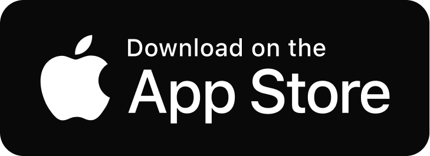

# Booka App

# Waschprofis sind nur einen Klick entfernt!

Unser On-Demand-Wäscheservice verbindet über eine einfache App Menschen, die Wäsche waschen wollen, mit Menschen, die gerne Wäsche waschen.

## Unsere Mission

Unsere Mission ist es, die Art und Weise, wie Menschen Wäsche waschen, revolutionär zu verändern. Wir wollen eine nahtlose Verbindung zwischen denen herstellen, die ihre Wäsche waschen möchten, und denen, die gerne Wäsche waschen, schaffen. Durch unsere innovative On-Demand-Plattform streben wir danach, Zeit und Energie für unsere Kunden zu sparen, die Umweltbelastung zu reduzieren und gleichzeitig neue Einkommensmöglichkeiten für unsere Service-Provider zu schaffen. Unser Ziel ist es, das lästige Waschen und Bügeln von Wäsche zu einem stressfreien und bequemen Erlebnis für jeden zu machen.

## Unsere Vision

Unsere Vision ist es, die führende Plattform für On-Demand-Wäscheservices weltweit zu werden. Wir möchten eine Zukunft gestalten, in der die Notwendigkeit, persönlich Wäsche zu waschen, zur Vergangenheit gehört. Durch kontinuierliche Innovation und Verbesserung unserer Technologie streben wir danach, die Effizienz und Benutzerfreundlichkeit unserer Plattform kontinuierlich zu steigern. Wir sehen eine Welt, in der Menschen die Freiheit haben, ihre kostbare Zeit für die Dinge zu nutzen, die ihnen wirklich wichtig sind, während sie die Sorge um ihre Wäsche uns überlassen können. Gleichzeitig setzen wir uns für Nachhaltigkeit ein, indem wir Ressourcen schonen und die Abfallproduktion minimieren. Wir sind davon überzeugt, dass unser Dienst das Leben der Menschen verbessern und einen positiven Beitrag zur Umwelt leisten kann.

## Lean UX

#### 1. Kundensegmente (Customer Segments):

- Berufstätige Personen mit wenig Zeit für Wäschepflege.
- Studenten und Menschen in städtischen Gebieten ohne Waschmöglichkeiten.
- Senioren oder Personen mit eingeschränkter Mobilität.

#### 2. Problem (Problem):

- Mangel an Zeit oder Zugang zu einer Waschmaschine.
- Mühsame Wäscherei-Aufgaben.
- Schwierigkeiten bei der Terminplanung für Wäschepflege.

#### 3. Lösung (Solution):

- On-Demand-Wäscheservice über eine benutzerfreundliche App.
- Erfahrene und zuverlässige Wäschepersonen, um die Wäsche zu waschen und zu liefern.
- Flexible Terminvereinbarung und Lieferung.

#### 4. Wertversprechen (Unique Value Proposition):

- Saubere, frische Wäsche ohne den Aufwand.
- Bequeme Terminplanung und Lieferung.
- Zuverlässige und qualitativ hochwertige Dienstleistungen.

## MVP - Minimum Viable Product

### First Features

1. Anmeldung (Login/Registrierung) [CHECK]
2. Auftrag erstellen und senden […]
3. Terminplanung und -verwaltung […]
4. Profile Settings […]

### Second Features

1. Locationservice […]
2. Bewertungs- und Feedbacksytem […]

## Gamification

- Belohnungssystem 

## Future Support

...

## User Flow

#### Schritt 1: Startbildschirm

- Benutzer öffnet die App und sieht den Startbildschirm.

#### Schritt 2: Klick auf "Create Order"

- Der Benutzer klickt auf die Schaltfläche "Create Order".

#### Schritt 3: Wäschetyp auswählen

- Nachdem der Benutzer auf "Create Order" geklickt hat, wird er aufgefordert, den Wäschetyp auszuwählen. Dies könnte Optionen wie "Normale Wäsche", "Empfindliche Wäsche" oder "Bettwäsche" umfassen.

#### Schritt 4: Wäschemenge und -details angeben

- Der Benutzer gibt die Menge der zu waschenden Wäsche an und kann weitere Details wie spezielle Anweisungen oder Flecken auf der Kleidung hinzufügen.
- Auch das Falten übernehmen wir

#### Schritt 5: Lieferzeit festlegen

- Der Benutzer wählt die gewünschte Lieferzeit für die gewaschene Wäsche aus. Dies könnte "Sofort", "In ein paar Stunden" oder "Morgen" sein.

#### Schritt 6: Abholadresse angeben

- Der Benutzer gibt seine Adresse an, an der die gewaschene Wäsche abgeholt werden soll.

#### Schritt 7: Suche nach verfügbaren Personen

- Der Benutzer hat die Möglichkeit, in der Nähe verfügbare Personen anzuzeigen, die bereit sind, seine Wäsche zu waschen.
- Die App zeigt den Status dieser Personen an, z. B. "active", "offline" oder "requested".

#### Schritt 8: Auswahl einer Person

- Der Benutzer wählt eine verfügbare Person in seiner Nähe aus, um die Wäsche zu waschen und die Abholung zu arrangieren.

#### Schritt 9: Bestellung überprüfen

- Vor der Bestätigung der Bestellung erhält der Benutzer eine Zusammenfassung aller eingegebenen Informationen, einschließlich des ausgewählten Waschdienstes.

#### Schritt 10: Bestellung bestätigen

- Nach der Überprüfung bestätigt der Benutzer die Bestellung.

#### Schritt 11: Bestätigungsnachricht

- Der Benutzer erhält eine Bestätigungsnachricht, die die Details der Bestellung und die geschätzte Lieferzeit enthält.

#### Schritt 12: Abholung der Wäsche

- Die ausgewählte Person holt die Wäsche persönlich von der angegebenen Adresse des Benutzers ab und verwendet unseren nachhaltigen Wäschesack für den Transport.

#### Schritt 13: Wäsche waschen

- Die ausgewählte Person wäscht die Kleidung gemäß den Anweisungen des Benutzers.

#### Schritt 14: Lieferung der gewaschenen Wäsche

- Die ausgewählte Person liefert die gewaschene Wäsche zum ausgewählten Zeitpunkt an der angegebenen Lieferadresse und verwendet den nachhaltigen Wäschesack.

#### Schritt 15: Behalten des Wäschesacks

- Nach der Lieferung behält der Kunde den nachhaltigen Wäschesack und kann ihn für zukünftige Aufträge verwenden.
- Unser Wäschesack der bequem und umweltfreundlich ist.

## Layer-First

Presentation Layer:
`screens/` (enthält alle Bildschirme)
`widgets/` (wiederverwendbare UI-Komponenten)

Business Logic Layer:
`models/` (Datenmodelle)
`repositories/` (Datenzugriff)
`services/` (Geschäftslogik)

Data Layer:
`data_sources/` (Datenquellen, z.B. API-Clients)
`data_models/` (Modelle für Daten aus Datenquellen)
`local_storage/` (lokale Datenspeicherung, z.B. SQLite)

Utilities:
`utils/` (Hilfsfunktionen, Konstanten)

## Autor

Mario Krutzikowsky

## Lizenz

Copyright © 2023, Mario Krutzikowsky# laundry_app

## Download our App

Get the app on:

